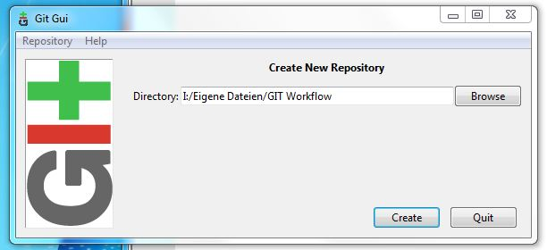
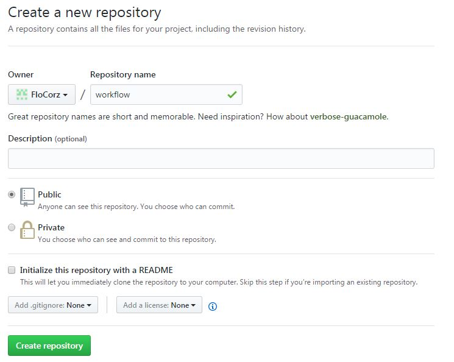
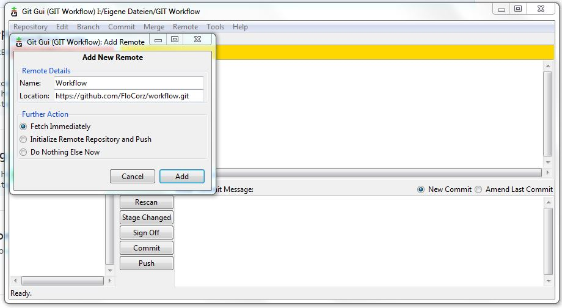

# Workflow 

1. Programm GitGui öffnen und lokales Repo erstellen 
 
1. workflow.md hinzufügen 
1. Neues Repository bei Github erstellen
 
1. Link bei GitGui einfügen 
 
1. Datei rescan, stage changed, sign off, commit und push auf github